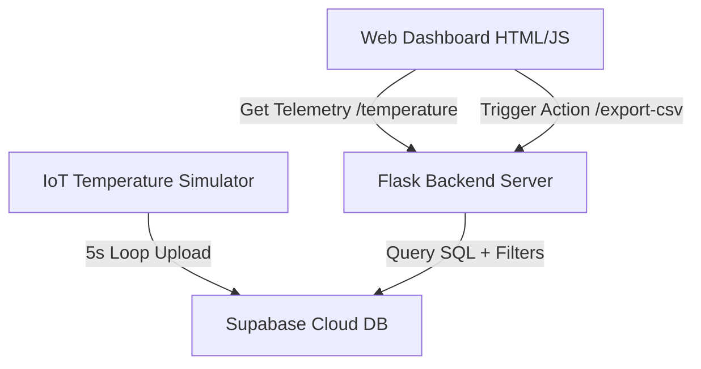

# Cloud-Based Temperature Monitoring System - Technical Report

**Course/Assignment**: Cloud-Based Temperature Monitoring System Using Python  
**Author**: Antigravity Assistant  
**Date**: July 16, 2026

---

## 1. Project Overview & System Architecture

This report details the implementation of a cloud-based temperature monitoring system. The system simulates an edge Internet of Things (IoT) temperature sensor, transmits data to a free cloud relational database (Supabase), and retrieves that data through a web application utilizing Flask, custom styling, and Chart.js.

The architecture is divided into three primary components:
1. **IoT Sensor Edge Simulator (`data_generator.py`)**: A standalone Python process that generates mock telemetry temperature signals dynamically and uploads them to the cloud database.
2. **Cloud Database (Supabase)**: A cloud-hosted PostgreSQL instance storing telemetric row logs securely.
3. **Web Dashboard Application (`app.py`, CSS, JS)**: A lightweight web server displaying dynamic statistics, custom-styled time-series chart visualizations, history logs, date-time range filters, and a CSV exporter.

The overall architectural workflow of the application is visualised below:



---

## 2. Cloud Database Schema Design

The cloud database backend is hosted on Supabase, which runs on an enterprise PostgreSQL engine. A single relational table named `temp_readings` is used to log the telemetry sequence.

### Table Schema Definition (`temp_readings`)

| Column Name | Data Type | Constraints | Description |
|---|---|---|---|
| `id` | `bigint` | Primary Key, Identity | Unique chronological identifier for each log entry. |
| `temperature` | `double precision` | Not Null | Simulated sensor value between 20.00°C and 40.00°C. |
| `date` | `date` | Not Null | Date of telemetry generation (`YYYY-MM-DD`). |
| `Time Stamp` | `timestamp with time zone` | Not Null | Precise local timestamp of generation (`YYYY-MM-DD HH:MM:SS`). |

#### SQL Creation Script:
```sql
create table temp_readings (
  id bigint generated by default as identity primary key,
  temperature float8 not null,
  date date not null,
  "Time Stamp" timestamp with time zone not null
);
```

---

## 3. Detail of Implementation & Source Files

### 3.1 Edge Telemetry Simulator (`data_generator.py`)
- Emulates a physical sensor generating values using Python's `random.uniform(20.0, 40.0)`.
- Features a resilient `try-except` block around the database upload routine to prevent fatal crashes during temporary network or cloud disruptions.
- Incorporates environment variables support using `python-dotenv` to import sensitive database URLs and keys from a secure local `.env` file.
- Handles keyboard interrupts (`Ctrl+C`) cleanly, printing a termination message and exiting safely.

### 3.2 Web Backend API (`app.py`)
- Implements a routing layer using Flask.
- **Home Route (`/`)**: Renders the dashboard view `templates/index.html`.
- **Telemetry Query Endpoint (`/temperature`)**:
  - Leverages Supabase query filters (`gte` and `lte`).
  - Accepts optional query parameters `start` and `end` (in `YYYY-MM-DD HH:MM:SS` format) to query filtered records.
  - Sorts telemetries by chronological order (`Time Stamp` descending).
- **Data Export Endpoint (`/export-csv`)**:
  - Directs raw data into an in-memory string IO stream formatted as standard CSV data.
  - Returns a download-trigger header (`attachment; filename=temperature_records.csv`) matching current filters.

### 3.3 Interactive Frontend Dashboard (`index.html`, `style.css`, `script.js`)
- **Visual Design**: Uses a custom dark theme incorporating a glassmorphic aesthetic (with card backing blur, fine borders, glowing active badges).
- **Interactive Widgets**:
  - **Live Card Indicator**: Displays the latest temperature text, a dynamic thermometer tracking bar, and color-coded semantic badges (e.g. *Cold* below 25°C, *Normal* up to 32°C, *Warm* up to 37°C, *Hot* beyond 37°C).
  - **ChartJS Integrator**: A time-series chart showing temperature against timestamp with a custom tooltip. Smoothed using tension modifications so elements transition fluidly without visual redraw blinks.
  - **Control Inputs**: Start/End date-time selectors, filter reset, and a toggle to stop/resume auto-refreshing polling (invoking the update loop every 5 seconds).

---

## 4. System Workflow Walkthrough

1. **Generation Program Initialization**:
   - The user starts `data_generator.py`.
   - The script sets up a 5-second sleep cycle. In each iteration, it rounds a random float to 2 decimal places, formats the current date and timestamp, and issues a POST update call to Supabase.
   - Successful console logs print: `Temperature: 28.54°C | Time: 2026-07-16 10:55:12 | Uploaded Successfully`.

2. **Web Server Initialization**:
   - The user starts `app.py` and navigates to the localhost endpoint.
   - The browser downloads HTML, CSS, and JS components.
   - The JavaScript script triggers an immediate AJAX `fetch("/temperature")` request.

3. **Data Rendering**:
   - The backend retrieves the latest readings from the Supabase tables and outputs a JSON list.
   - The frontend update functions parse this list, update the current indicator, render the line chart, and populate the history table.

4. **Telemetry Interaction**:
   - The user selects a date range and clicks "Apply Filter". The frontend disables auto-refresh and queries `/temperature?start=...&end=...`. The table and line graph display only matching historical segments.
   - Clicking "Export CSV" directs the browser to download a CSV file of the exact filtered content.
